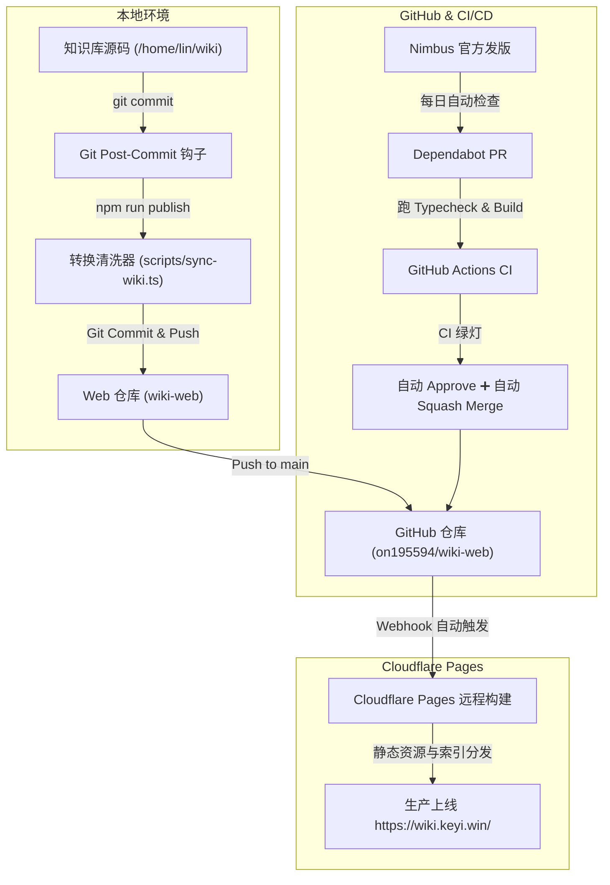

# Wiki Web (Powered by Cloudflare Nimbus)

这是针对知识库 `/home/lin/wiki`（[on195594/wiki](https://github.com/on195594/wiki)）的松耦合独立 Web 发布端，基于 **Cloudflare Nimbus** 和 **Astro** 构建。

- 🌐 **生产访问地址**：[https://wiki.keyi.win/](https://wiki.keyi.win/)
- 📦 **Web 仓库**：[on195594/wiki-web](https://github.com/on195594/wiki-web)
- 📚 **源知识库**：[on195594/wiki](https://github.com/on195594/wiki)

---

## 核心设计原则

1. **零侵入与解耦**：完全保持 `/home/lin/wiki` 的纯净性与独立性，不向主知识库写入任何前端配置或 Node 依赖；发布流通过 Git Hook 与转换器单向抽取。
2. **人类与 Agent 双一等公民**：
   - **面向人类**：基于 Cloudflare Nimbus 规范与 Pagefind 提供亚毫秒级全文检索、代码高亮、暗黑模式与响应式排版。
   - **面向 Agent**：提供 `/llms.txt`、`/llms-full.txt` 以及每篇文档的纯净 Markdown 端点（`/<slug>/index.md`），方便 LLM 直接抓取消费。
3. **双链智能解析与代码块语法保护**：
   - 自动将 Obsidian 风格的双向链接（`[[wikilinks]]`）、别名（Aliases）和锚点转换为标准 Web 相对链接。
   - 严格保护多行代码块（```）与行内代码（`），确保代码示例、正则与语法定义中的双链字面量不受破坏。
4. **全链路无人值守自动化**：
   - 本地提交即发布：支持通过 Git Post-commit Hook 自动同步、提交并推送。
   - 云端秒级部署：Cloudflare Pages 监听 `main` 分支自动构建并在全球 CDN 生效。
   - 上游无缝升级：集成 GitHub Dependabot 每日追踪 Nimbus 依赖发版，经 CI 质检绿灯后自动完成 Squash Merge。

---

## 自动化流水线



---

## 常用命令

| 命令 | 说明 |
| :--- | :--- |
| `npm run publish` | **一键发布**：同步源 Wiki、检查变更、自动 Git 提交并推送到 GitHub，触发上线。 |
| `npm run sync` | 仅执行增量转换与双链解析（`/home/lin/wiki` ➡️ `src/content/docs`）。 |
| `npm run dev` | 启动本地热重载开发服务器（自动触发 `predev` 预同步）。 |
| `npm run build` | 静态编译与 Pagefind 全文检索索引生成（自动触发 `prebuild`）。 |
| `npm run preview` | 本地预览生产构建产物（`http://localhost:4321`）。 |
| `npm run typecheck` | 执行 Astro 与 TypeScript 类型合规检查（`astro check`）。 |
| `npm test` | 执行双链转换、代码保护及发布重试的本地 Git 回归测试。 |

---

发布会先提交文档差异，再通过 `git pull --rebase origin main` 保留远端更新并正常推送。即使文档没有新差异，也会补推上次已提交但未推送的内容。发生内容冲突或推送失败时退出报错，不强制覆盖远端；解决冲突后可再次执行 `npm run publish`。

转换器递归扫描正式知识分类，保留嵌套目录作为 Web 路由；正文双链仍按文件名或别名解析。

## 环境变量说明

| 变量名 | 默认值 | 说明 |
| :--- | :--- | :--- |
| `SITE_URL` | `https://wiki.keyi.win` | 生产环境站点根 URL，驱动 canonical、sitemap、OG 图片及 `llms.txt`。 |
| `WIKI_ROOT` | `/home/lin/wiki` | 本地源 Wiki 知识库根目录。远程 CI runner 若未找到该目录将平滑降级使用已提交文档。 |
| `SKIP_WIKI_PUBLISH` | *空* | 若设为 `1`，在本地 Wiki 执行 `git commit` 时跳过自动发布。 |
| `WIKI_PUBLISH_ASYNC` | *空* | 若设为 `1`，在本地 Wiki 执行 `git commit` 时在后台静默执行发布，不阻塞终端。 |

---

## 项目结构

```
wiki-web/
├── .github/
│   ├── dependabot.yml     # Dependabot 每日追踪 Nimbus 与 npm 依赖配置
│   └── workflows/ci.yml   # CI 自动化类型检查、构建测试与无人值守自动合并
├── astro.config.ts        # Nimbus 与 Astro 配置（默认绑定 https://wiki.keyi.win）
├── wrangler.jsonc         # Cloudflare Pages 部署配置
├── scripts/
│   ├── sync-wiki.ts       # Wiki 知识库同步、代码保护与双链转换器
│   ├── publish.ts         # 一键发布与差异提交驱动器
│   └── test-sync.ts       # 双链转换与代码块语法保护单元回归测试
├── src/
│   ├── content.config.ts  # 文档集合与 Schema 校验（兼容 Wiki 元数据）
│   ├── content/docs/      # 经转换生成的文档源码
│   └── ...                # 页面、布局、Tailwind 样式
└── dist/                  # 构建产物（HTML + Markdown + Pagefind 索引）
```
